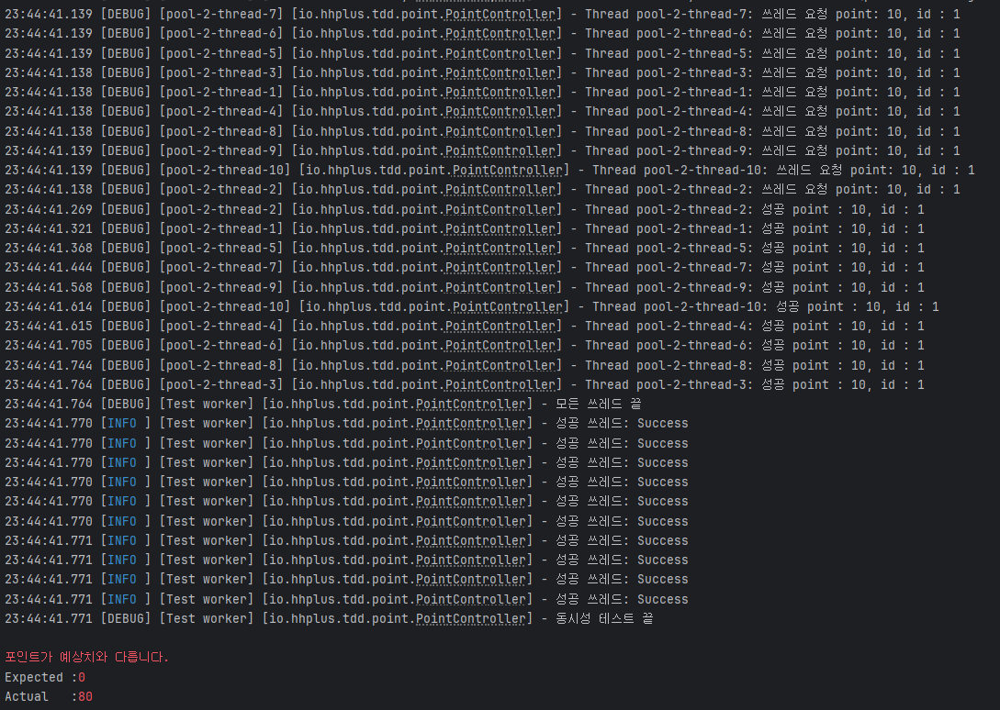

# 항해 플러스 [ 1주차 과제 ] TDD 로 개발하기

## 요구사항
- PATCH  `/point/{id}/charge` : 포인트를 충전한다.
- PATCH `/point/{id}/use` : 포인트를 사용한다.
- *GET `/point/{id}` : 포인트를 조회한다.*
- *GET `/point/{id}/histories` : 포인트 내역을 조회한다.*
- *잔고가 부족할 경우, 포인트 사용은 실패하여야 합니다.*
- *동시에 여러 건의 포인트 충전, 이용 요청이 들어올 경우 순차적으로 처리되어야 합니다.*

## 동시성 이슈가 발생하는 이유

유저가 포인트를 사용하는 api를 동시에 요청했다고 가정해보자

```java
@BeforeEach
    public void setUp() {
        // 초기 데이터 설정
        userPointTable.insertOrUpdate(1L, 100L); // 유저 ID 1, 포인트 30
    }

    @Test
    public void testConcurrentPointUsage() throws InterruptedException {
        // Given
        long userId = 1L;
        long useAmount = 10L;
        int concurrentRequests = 10; // 동시에 실행할 쓰레드 수 (10회 사용 요청)

        // 동시성 테스트 실행
        chargePointsConcurrently(userId, useAmount, concurrentRequests);

        // Then: 포인트 상태 검증
        UserPoint finalState = pointService.findUserById(userId);

        // 기대 결과는 100 - 10 * 10 = 0 (중복 차감이 발생하면 이보다 큰 값이 나타날 가능성 있음)
        assertEquals(0L, finalState.point(), "포인트가 예상치와 다릅니다.");
    }
    ...

IntStream.range(0, times).forEach(i -> {
            results.add(executorService.submit(() -> {
                awaitLatch(latch);
                log.debug("Thread {}: 쓰레드 요청 point: {}, id : {}", Thread.currentThread().getName(), amount, id);

                try {
                    pointService.updateUserPoint(id, amount); // 포인트 사용 요청
                    log.debug("Thread {}: 성공 point : {}, id : {}", Thread.currentThread().getName(), amount, id);
                    return "Success";
                } catch (Exception e) {
                    log.error("Thread {}: 실패 id : {}, 에러메세지 : {}", Thread.currentThread().getName(), id, e.getMessage());
                    return "Error: " + e.getMessage();
                }
            }));
            latch.countDown();
        });
```

이렇게 id : 1, amount : 100 인 초기 유저를 세팅하고
10번의 포인트(10) 사용을 동시에 호출해보자

실제를 100 - 10 * 10 = 0 으로 0의 값이 기대된다

하지만 테스트 결과


기대된 값은 0이지만 실제론 80이 출력 됨을 알 수 있다

이유를 살펴보면 다음과 같다
(편의상 2개의 요청으로 보겠습니다.)


2개의 api 요청이 동시에 들어온다
-> springboot 에서 2개의 쓰레드를 동시에 제공(thread A, thread B)

A, B 각각 유저 조회 (user(id :1, amount: 100), user(id:1, amount : 100))

동시의 10의 포인트를 사용 후 저장
user(id : 1, amount : 90)
user(id : 1, amount : 90) 이 덮어 씌어짐


위와 같은 문제로 동시성 처리에 문제가 발생한다.

## 해결 방법

동시성 문제 해결을 위해서 동시에 자원을 공유 하는 것을 막기위해 lock 기술이 활용된다

대표적인 lock 기술 (synchronized, reentrantLock)

*synchronized
synchronized는 Java의 키워드로, 특정 코드 블록 또는 메서드에 대해 스레드 안전하게 동시 접근을 방지한다.

// 사용예시
```java
public synchronized void method() {
    // 동기화된 메서드
}

public void method() {
    synchronized (this) {
        // 동기화된 블록
    }
}
```
락 해제 조건 : 작업이 끝나거나 예외가 발샹하면 jvm이 락을 자동으로 해제


*reentrantLock
// 사용예시
```java
ReentrantLock lock = new ReentrantLock();

lock.lock(); // 락 획득
try {
    // 임계 영역
} finally {
    lock.unlock(); // 반드시 락 해제
}

```

두 방식은 성능에 있어 차이를 보인다
*synchronized

synchronized 는 다른 id의 처리도 lock 을 건다
ex) id = 1 , id = 2 가 동시에 요청을 하더라도 lock 을 걸어 다른 id 일 시 처리중인 thread 가 끝이 나야 다른 id 의 요청이 수행된다

반면
reentrantLock 경우
key : value 형태로 다루기 때문에 id 를 key 값으로 잡아 같은 key 즉 , 같은 id 만 lock 걸게끔 한다

```java
    public void lock(Long userId) {
        locks.computeIfAbsent(userId, k -> new ReentrantLock()).lock();
    }
```

## 내가 선택한 방법

나는 다른 id별로 효율적인 lock 관리를 위해 reentrantLock 을 활용했다


요청 시간을 보면 동시에 요청을 하고
처리 시간을 보면 약간의 시간을 거처(lock 걸림 이유) 응답을 주는 것을 알 수 있고 테스트도 정상적으로 통과했다.

## 발전 방향

reentrantLock 은 JVM의 메모리 내부에서만 관리 되기 때문에 다른 JVM 에서 실행 중인 스레드를 인식할 수 없다

ex.
어플리케이션 A : jvm1
어플리케이션 B : jvm2

jvm1 에서 reentrantLock 에 걸렸다고 해서
jvm2 에서는 락 걸림 유무를 확인 할 수 없다.

요즘과 같은 분산환경에서 활용하기엔 문제가 발생할 수 있다.

따라서 redis를 활용하는 방식을 고민해봐야 할거 같다.